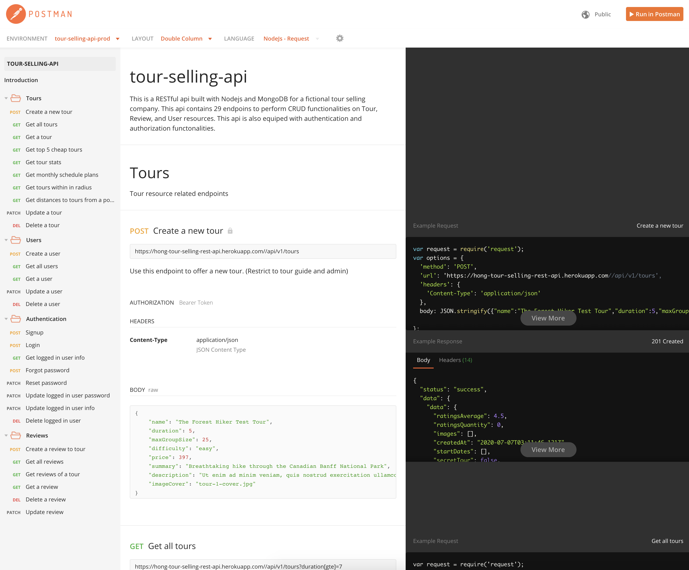
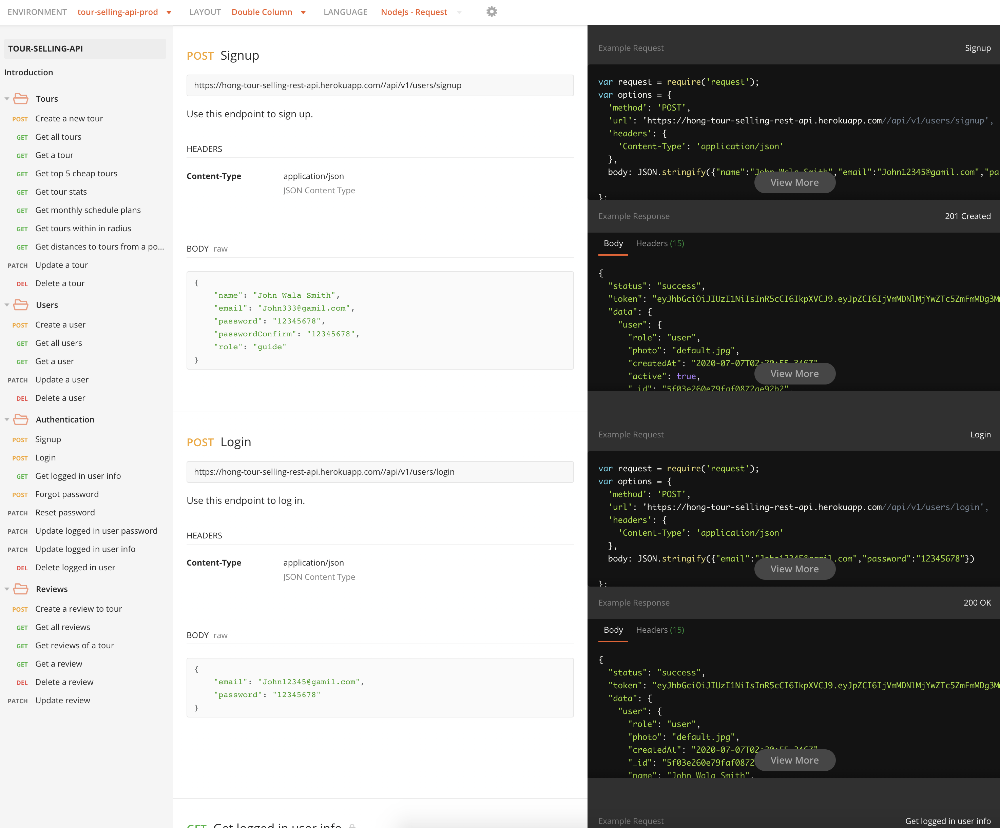

# REST api for tour selling company

#### This is a RESTful api built with Nodejs and MongoDB for a fictional tour selling company. This api contains 29 endpoins to perform CRUD functionalities on Tour, Review, and User resources. This api is also equiped with authentication and authorization functonalities.

[View full api doc please click here](https://documenter.getpostman.com/view/10852128/Szzn5GB6?version=latest)

## API DOC SNEAKPEAK:

